# A mental model of how Futures and runtimes work

The main goal in this part is to build a high level
mental model of how the different pieces we read about in the previous chapter
works together. I hope this will make it easier to understand the high level concepts
before we take a deep dive into topics like trait objects and generators in the next
few chapters.

This is not the only way to create a model of an async system since we're making
assumptions on runtime specifics that can vary a great deal. It's the way I found
it easiest to build upon and it's relevant for understanding a lot of real
implementations you'll find in the async ecosystem.

Finally,please note that the code itself is "pseudo-rust" due to the need for brevity
and clarity.

>Click on a page to open a larger view in a new tab.

<a href="./assets/slides/Slide2.PNG" target="_blank">
 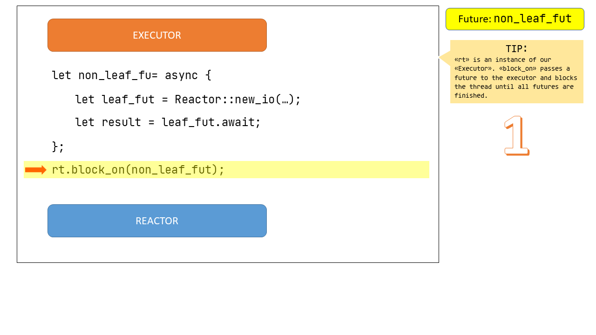
</a>

<a href="./assets/slides/Slide4.PNG" target="_blank">
 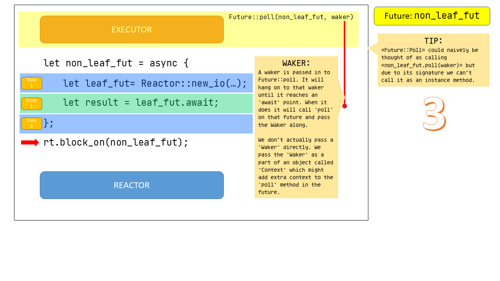
</a>

<a href="./assets/slides/Slide6.PNG" target="_blank">
 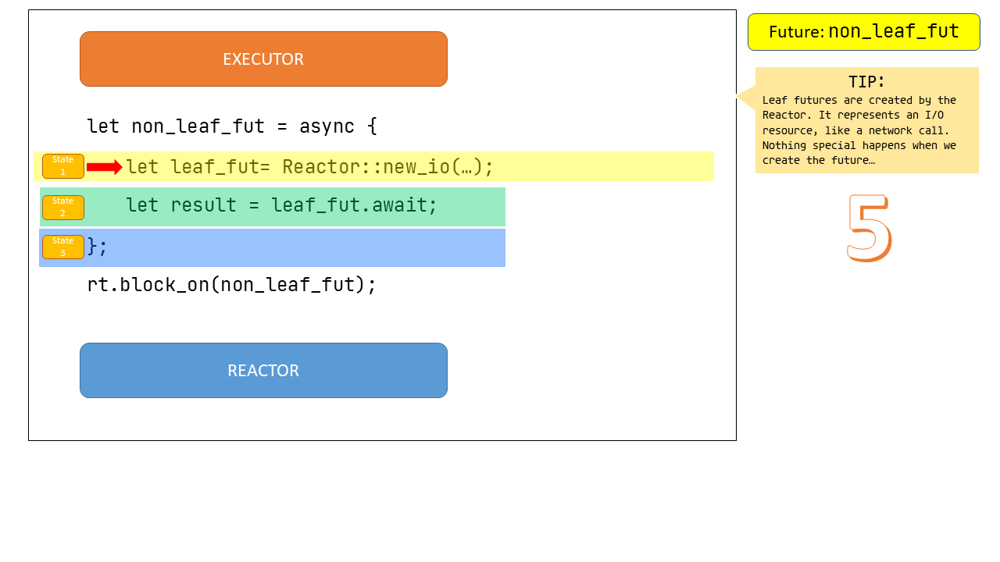
</a>
<a href="./assets/slides/Slide7.PNG" target="_blank">
 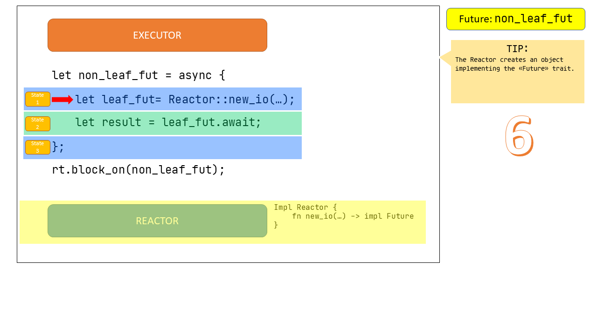
</a>
<a href="./assets/slides/Slide8.PNG" target="_blank">
 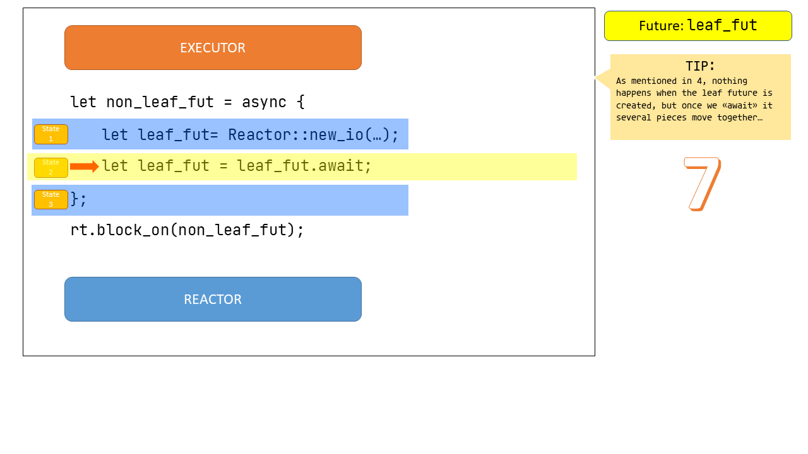
</a>
<a href="./assets/slides/Slide9.PNG" target="_blank">
 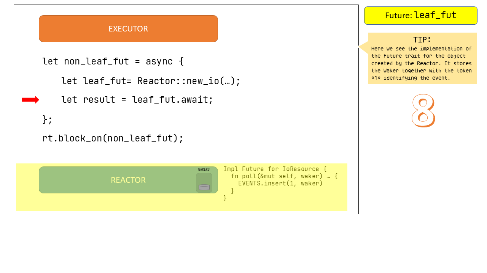
</a>
<a href="./assets/slides/Slide10.PNG" target="_blank">
 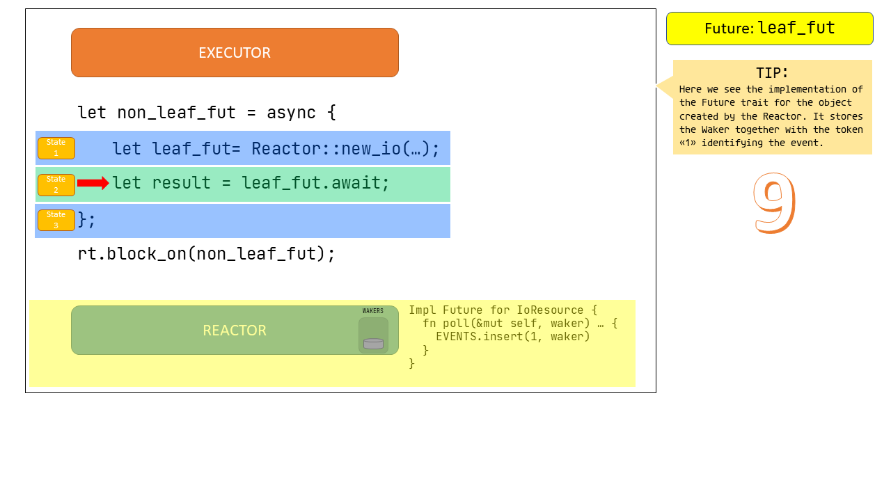
</a>
<a href="./assets/slides/Slide11.PNG" target="_blank">
 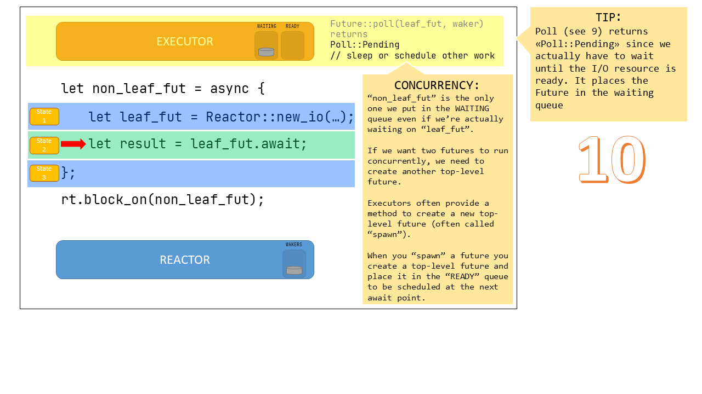
</a>

<a href="./assets/slides/Slide13.PNG" target="_blank">
 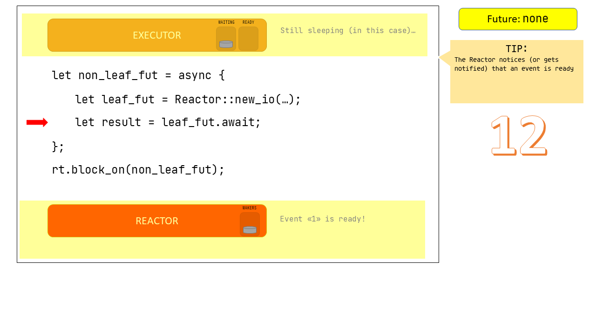
</a>
<a href="./assets/slides/Slide14.PNG" target="_blank">
 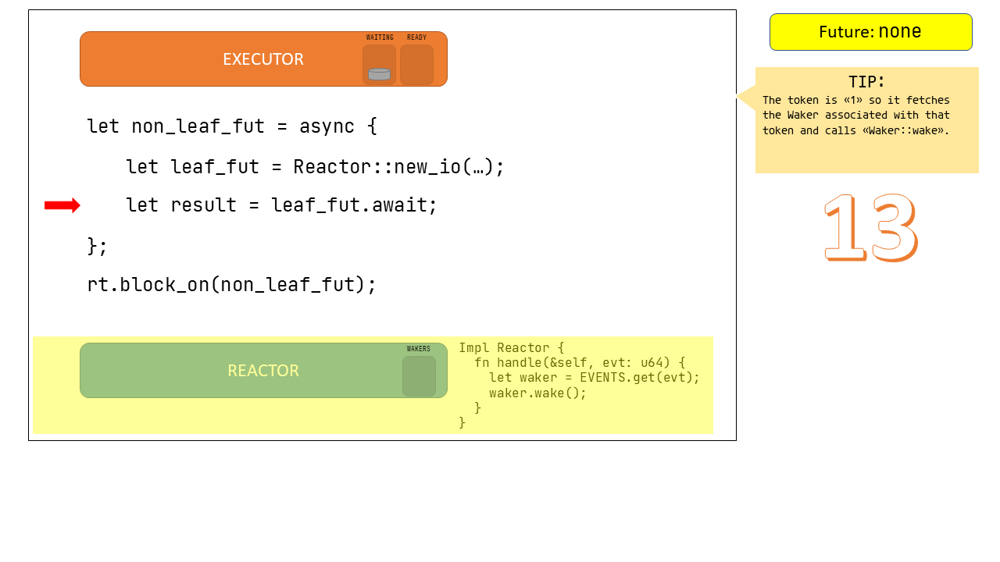
</a>
<a href="./assets/slides/Slide15.PNG" target="_blank">
 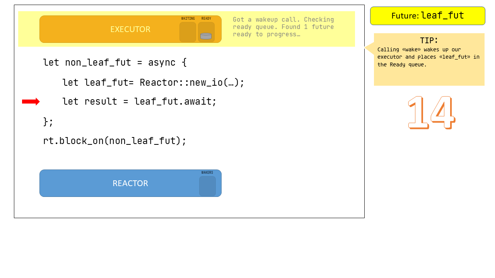
</a>
<a href="./assets/slides/Slide16.PNG" target="_blank">
 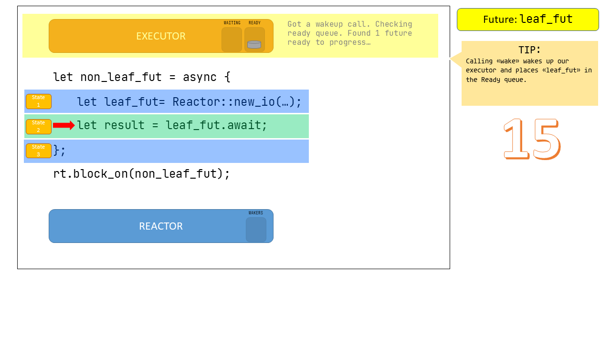
</a>
<a href="./assets/slides/Slide17.PNG" target="_blank">
 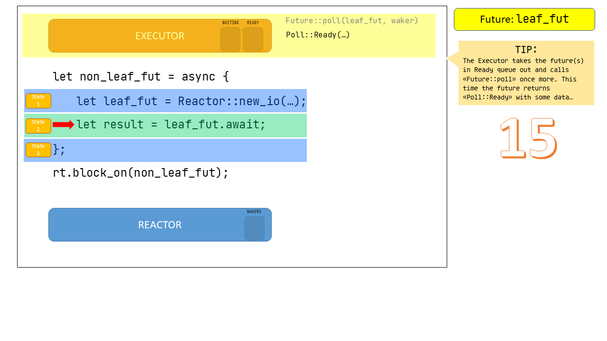
</a>
<a href="./assets/slides/Slide18.PNG" target="_blank">
 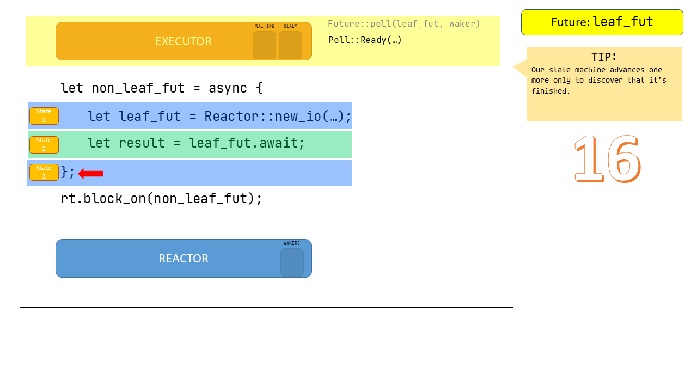
</a>
<a href="./assets/slides/Slide19.PNG" target="_blank">
 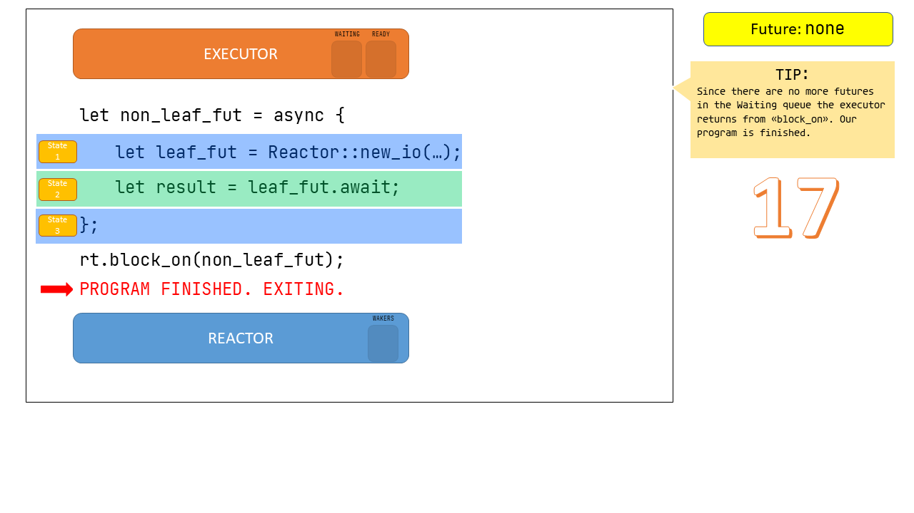
</a>
